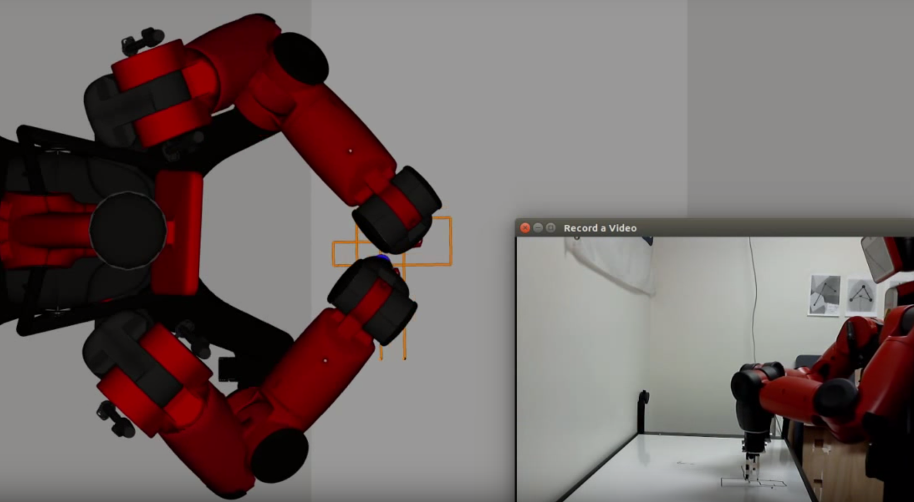

# BOLT

The project consists of two major components

- The Bolt planner for efficiently pre-computing sparse roadmap spanners for experience-based planning
- An multi-modal underconstrained Cartesian planner for dual arms similar to [Descartes](http://wiki.ros.org/descartes)

Developed by [Dave Coleman](http://dav.ee/) at the University of Colorado Boulder in collaboration with ROS Industrial, Southwest Research Institute, and the National Institute of Standards and Technology.

Status:

 *  Travis - Continuous Integration

See [video](https://www.youtube.com/watch?v=Tw3qOeOAKlc)

### Build from Source

Runs on ROS Kinetic. To build this package, create a [catkin workspace](http://wiki.ros.org/catkin/Tutorials/create_a_workspace).

    sudo apt-get install python-wstool python-catkin-tools wmctrl
    wstool init .
    wstool merge https://raw.githubusercontent.com/davetcoleman/bolt/kinetic-devel/bolt.rosinstall
    wstool update
    wget https://raw.githubusercontent.com/ros-gbp/ompl-release/debian/kinetic/xenial/ompl/package.xml -O ompl/package.xml
    sudo apt-get remove ros-${ROS_DISTRO}-ompl
    rosdep install -y --from-paths . --ignore-src --rosdistro ${ROS_DISTRO}
    cd ..
    catkin config --extend /opt/ros/${ROS_DISTRO} --cmake-args -DCMAKE_BUILD_TYPE=Release
    catkin build

## Run in Docker

Run with just terminal:

    docker run -it davetcoleman/bolt:bolt-kinetic-build

## Layout

- bolt_core: The core algorithm for sparse roadmap creation and multi-model task planning is locate
- bolt_ros: a common interface for bolt_core and ROS components shared by other packages
- bolt_2d: A simple 2d/3d toy problem for testing bolt in a low dimensional space using Rviz
- bolt_moveit: A MoveIt!-based configuration space for running with Baxter

## Usage

There are currently two main applications for using bolt - 2d and moveit. See the respective folders on how to use them.

## Testing and Linting

To run [roslint](http://wiki.ros.org/roslint), use the following command with [catkin-tools](https://catkin-tools.readthedocs.org/):

    catkin build --no-status --no-deps --this --make-args roslint

To run [catkin lint](https://pypi.python.org/pypi/catkin_lint), use the following command with [catkin-tools](https://catkin-tools.readthedocs.org/):

    catkin lint -W2

There are currently no unit or integration tests for this package. If there were you would use the following command with [catkin-tools](https://catkin-tools.readthedocs.org/):

    catkin run_tests --no-deps --this -i
