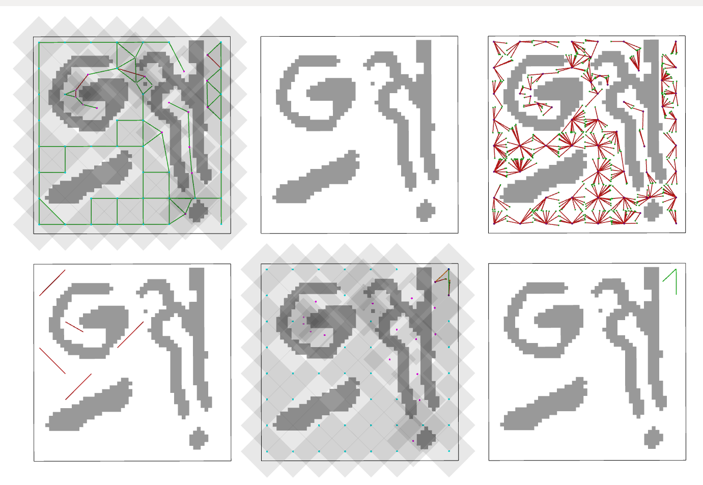

# Bolt 2D

Two and three dimensional "toy problem" for testing Bolt

## Usage

Start Rviz using the included launch file:

```
roslaunch bolt_2d bolt_rviz.launch
```
To run:

```
wmctrl -a RViz && roslaunch bolt_2d bolt_2d.launch
```

You should see something like:



This should create the SPARS graph 10 times (or whatever is set in the config file) and show lots of visualizations in Rviz. This process is the thing we want to optimize (when visualiations are off).

If you get the terminal prompt "Waiting to continue: ..." press *Next* or *Auto* in the dashboard:


To change a configuration open the file ``bolt_2d/config/config_bolt_2d.yaml`` then restart the program

## Speedup

To make the algorithm much faster, turn off all the "verbose" and "visualize" settings in the config yaml file.
