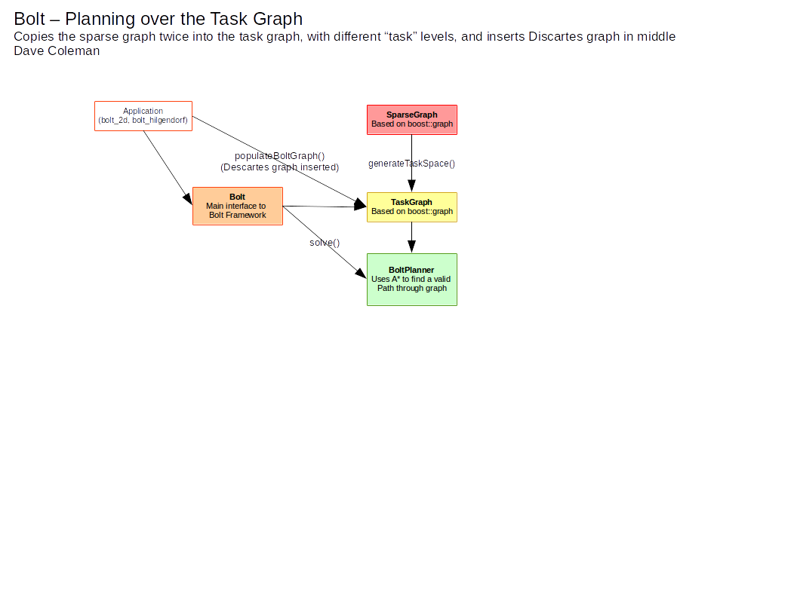

# BOLT CORE

Main planner based on SPARS2 using OMPL

  - Ability to discretize roadmap intelligently
  - Ability to plan over a discrete task dimension

## Architecture

## Developer Notes

There are 6 visualization windows that are each used for multiple different things. Below I try to record their usages

### Window 1

- SparseGraph displayDatabase, addEdge, addVertex

### Window 2

- TaskGraph
- SparseGraph: addStateToRoadmap attempted states
- Connectivity

### Window 3

- Quality criteria: close reps
- Check Add Quality
- Find close representatives

### Window 4

- Astar search?
- Disjoint sets

### Window 5

- Check add path
- Quality criteria

### Window 6

- Start/goal states
- Collision environment
- Projection hack
- Quality criteria
- Remove close vertices
- Interface

### Vertex Colors

 - green:     coverage
 - brown:     connectivity
 - white:     interface
 - pink:      quality
 - purple:    cartesian
 - cyan:      discretized

### Edge Colors

 - orange:    connectivity
 - magenta:    interface
 - red:       quality
 - yellow:   cartesian
 - blue       discretized

## Debug Mode

Code can be added that only runs when compiled with the debug flag:

    #ifdef NDEBUG
      BOLT_ERROR(indent, "NOT IN DEBUG MODE");
    #else
      BOLT_ERROR(indent, "IN DEBUG MODE");
    #endif
