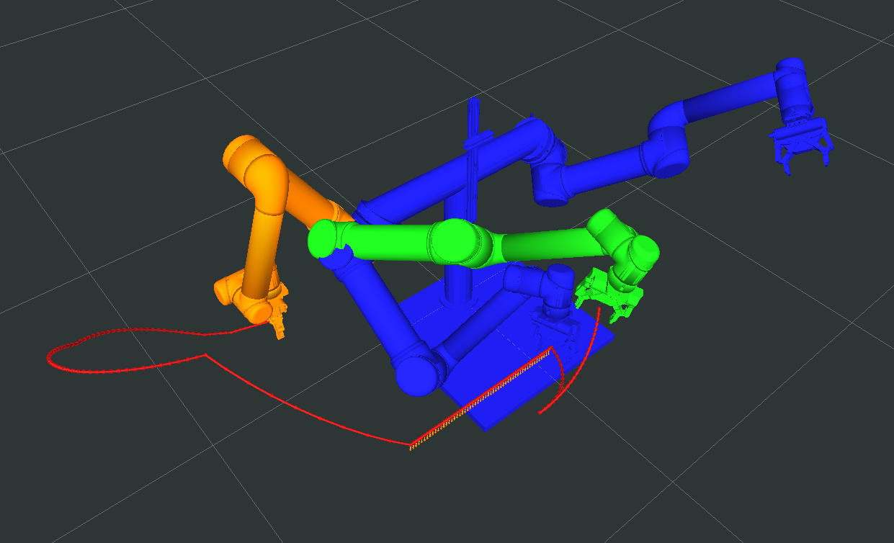

# Curie Demos

Description: Demonstrate dual arm manipulation using a combination of free space and Cartesian planning

Features:

 - Integration of OMPL + MoveIt + Descartes
 - Ability to discretize roadmap naively
 - Multi-modal task planning - have intermediate waypoint goals
 - Follow cartesian paths
 - Support for dual arms
 - Speedup using Thunder experience database

Developed by [Dave Coleman](http://dav.ee/) at the University of Colorado Boulder in collaboration with ROS Industrial, Southwest Research Institute, and the National Institute of Standards and Technology.

Status:

 *  Travis - Continuous Integration
 *  ROS Buildfarm - Trusty Devel Source Build
 *  ROS Buildfarm - AMD64 Trusty Debian Build

## Install

### Ubuntu Debian

> Note: this package has not been released yet

    sudo apt-get install ros-jade-curie-demos

### Build from Source

To build this package, ``git clone`` this repo into a [catkin workspace](http://wiki.ros.org/catkin/Tutorials/create_a_workspace) and be sure to install necessary dependencies by running the following command in the root of your catkin workspace:

    rosdep install -y --from-paths src --ignore-src --rosdistro jade

## Code API

> Note: this package has not been released yet

See [Class Reference](http://docs.ros.org/jade/api/curie_demos/html/)

## Usage

Start Rviz:

    roslaunch curie_demos hilgendorf_visualize.launch

Start simulated ros_control:

    ACTUALLY SKIP THIS STEP, NOT NECESSARY
    #roslaunch curie_demos hilgendorf_simulation.launch

Run example demo:

    wmctrl -a RViz && roslaunch curie_demos hilgendorf_demo.launch

Note: the first time you run the program, it will discretize the configuration space in a brute-force manner, using the ``sparse_delta`` config. This will likely take ~1 hour. It will then save the database in the folder:

    ~/ros/ompl_storage/

And in the future loading will be fast.

## Running on Amazon EC2

Assuming you have ssh connection configured in ``~/.ssh/config`` such as:

    Host amazonaws
        Hostname ec2-52-39-79-250.us-west-2.compute.amazonaws.com
        IdentityFile ~/.ssh/quickstartkeypair.pem
        Port 22
        User dave

To send latest files

    rsync -avgz --delete --progress "/home/dave/ros/current/ws_swri" amazonaws:"/home/dave/ros/current"

or in the shortcut:

    cd ~/unix_settings/scripts/rsync/
    . current_monster_to_amazon.sh

To run experiement:

    ssh amazonaws
    screen -LdmS bolt bash -c 'roslaunch curie_demos hilgendorf_demo.launch debug:=0'

Screen arguments key:

    -L log to file ~/screenlog.0
    -S name socket to useful tag
    -dm Start screen in detached mode. This creates a new session but doesn't attach to it. This is useful for system startup scripts.
    bash: send command

To detach from screen (stop logging):

    C-a d

To re-attach to screen

    screen -x

For more documentation on screen: http://aperiodic.net/screen/quick_reference

To download results back to local computer

    scp amazonaws:/home/dave/ros/ompl_storage/* /home/dave/ros/ompl_storage/amazon

## Setup as Dameon

    rosrun robot_upstart install myrobot_bringup/launch/base.launch

Documentation: http://docs.ros.org/api/robot_upstart/html/

## Configuration

There are lots of settings that can easily be tweaked in the following file:

    curie_demos/config/config_hilgendorf.yaml

In particular, pay attention to the ``visualize/`` configurations for more indepth view of what is going on.

## Distance between poses

Unfinished test code

    rosrun tf_keyboard_cal tf_interactive_marker.py world thing 0 0 0 0 0 0 1

    rosrun curie_demos test_pose_distance

## ROSCon Demo

    roslaunch plan_and_run demo_setup.launch sim:=true
    roslaunch hilgendorf_moveit_config move_group.launch allow_trajectory_execution:=true fake_execution:=false info:=true debug:=true
    roslaunch plan_and_run demo_run.launch

## Testing and Linting

To run [roslint](http://wiki.ros.org/roslint), use the following command with [catkin-tools](https://catkin-tools.readthedocs.org/):

    catkin build --no-status --no-deps --this --make-args roslint

To run [catkin lint](https://pypi.python.org/pypi/catkin_lint), use the following command with [catkin-tools](https://catkin-tools.readthedocs.org/):

    catkin lint -W2

There are currently no unit or integration tests for this package. If there were you would use the following command with [catkin-tools](https://catkin-tools.readthedocs.org/):

    catkin run_tests --no-deps --this -i

## Contribute

Please send PRs for new helper functions, fixes, etc!
